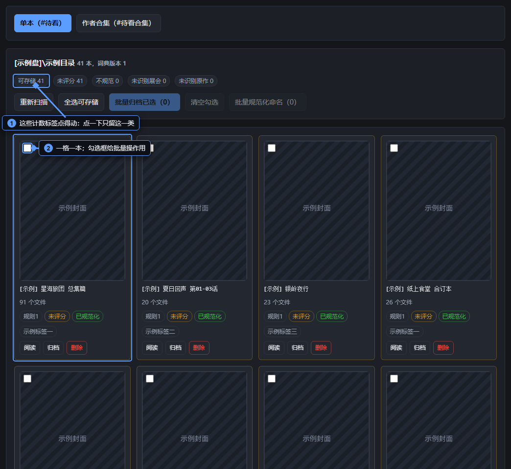
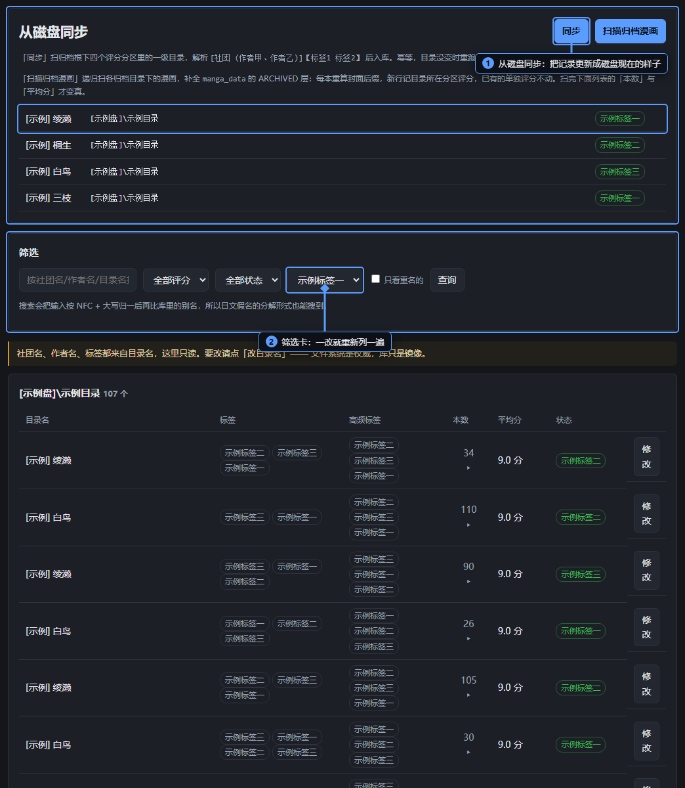
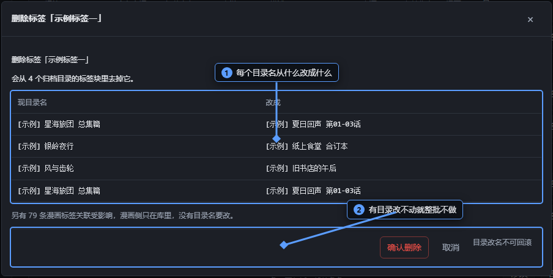

这一模块的日常是：新漫画进来 → 打分改名 → 压缩 → 归档；归档之后在「归档作者」里管目录和标签。

## 新漫画

刚下载下来、还没整理进库的漫画都堆在这一页，一格一本。

上面两个页签：**单本**看的是一本本散着的，**作者合集**看的是整个文件夹一起收的。

### 顶上那个搜索框

单本页最上面有一个输入框，敲几个字就只留下目录名里带这几个字的那些本子，**一边敲一边筛**，不用点查询、也不会重新扫盘。它跟下面那串计数标签是「都要满足」的关系：搜索框里留着一个词、又点了一个标签，看到的就是两样都符合的。

清空输入框就恢复成全部。

### 顶上那一串计数标签是能点的

扫完之后，工具条上会排出一串「可存储 12」「未评分 3」「不规范 2」「未识别展会 1」这样的标签。**它们不是说明文字，点得动**：点一个就只留下这一类，再点一个就是两个条件都要满足，点第三下取消。这只筛眼前这份列表，不会重新扫盘。选中之后，下面会多出一行「已筛选：……」，告诉你现在按哪几条在看。

要是连归档目录都还没有，这一页顶上会出红字告诉你：**所有漫画都会被判成未归档**，先去「归档作者」页跑一次同步。

### 单本页的工具条

- **重新扫描**：按磁盘现在的样子重扫一遍。刚拷进来的漫画，点一下就能看到。
- **全选可存储**：把当前列出来的、能归档的那些一次勾上。还不能归档的，勾选框本来就是灰的，鼠标移上去会告诉你为什么。
- **批量归档已选（3）**：把勾上的几本一起归档，走三步（下面单说）。一本没勾就灰着。
- **清空勾选**：把勾上的都取消。
- **批量规范化命名（5）**：把名字不规范的目录一次改成规范名。点开先给你一张清单：左边原名、右边改完的名字，默认全勾上，可以从里头去掉几个。跑完逐行告诉你哪几个改成了什么、哪几个没改成、为什么。

### 每一张卡片上

- 封面左上角的**勾选框**：给批量操作用的。这本还不满足归档条件时，勾选框是灰的，鼠标移上去会告诉你为什么。
- **点封面**和点「阅读」是一回事：打开全屏看正文。
- **归档**：打开归档弹窗，**不是点一下就归档**。改名、打分、挑标签都在那个弹窗里一次做完，看准了再提交。
- **删除**：连目录一起删。目录会进 Windows 回收站，删错了可以从那里还原。

### 只归档一本时，那个弹窗里有什么

点卡片上的**归档**，打开的是同一个弹窗，改名、打分、挑标签一次做完：

- 顶上改名字，旁边实时给你看改完长什么样——合不合规则、有没有认不出的展会名，都在那儿说。
- 中间选评分：**9 / 7 / 5 / 3**，点一下选中，旁边还有个**撤销**可以取消选中。
- 标签在下面选，也可以现打一个库里没有的新标签。
- 已经进过库的那本，标签那一行还会多一个**从 eh 拉取**，点它去 e-hentai 上重新拉一遍建议标签。
- 底下的按钮：只想改名字和标签就点**仅修改**；要连同归档一起做，点**修改后归档**——它会先告诉你准备归到哪个目录，再问你一次。

**「修改后归档」灰着**，多半是三件事之一：还没选评分、目录名不合规则、或者名字里有程序认不出的展会 / 原作。鼠标移上去会说是哪一件。

### 作者合集页

一个文件夹就是一个合集，整个一起收。

- 顶上的计数标签和单本页一样能点：可存储、目录名不合法、不规范、未识别展会、未识别原作，还有一个「作者已归档」。
- 卡片上的 **9 / 7 / 5 / 3**：给整个合选定一档。这只是先选中，点「存储整个合集」的时候才真的生效，而且**必须先选一档**。
- 旁边的标签框：写进去的标签会跟着目录名一起落盘，所以也受「必须打标签」那个开关管。
- **存储整个合集**：逐本压缩、把名字规范好，然后把整个文件夹搬进对应的归档目录。
- **删除合集**：连文件夹里的所有文件一起删（整个文件夹会进 Windows 回收站，可以从那里还原）。
- **展开 N 本**：看看里面都是哪几本。同一时间只能展开一个；展开之后每一本都能「阅读」「改名」「删除」（改名会弹一个输入框让你填新名字）。
- 要是这个作者已经有归档目录了，卡片上会直接点出来，提醒你去合并冲突页把两个并到一处。
- 合集真正能存之前，它的按钮是灰的，卡片上会一行行列着还差什么。

### 归档前的三步

点「批量归档已选」之后，是几个小窗口依次走：

1. **打标签**：可以留空。留空的话，程序归档时会自己去 e-hentai 上找一遍，找不到再让你手动补。
2. **逐本评分**：每一本都要选一档，全选完了「下一步」才亮起来。选错了旁边有「撤销」。
3. **再确认一次**：这里会写清楚压缩会删掉原图、以及会归到哪个目录去。这一步点了才开始动文件。

### 压不动的时候

归档会先压缩。**要是有图压不成，程序不会闷头往下走**：

- 单本或者批量归档时，会弹出一张清单，标题写着「N 本压缩有失败，仍要归档吗？」。每一本都列着压成了几张、失败的是哪几个文件、为什么失败。**每一本都要单独拿主意**：归档（保留已经压好的，压不成的原文件也一起带走），还是跳过（留在原地）。全部处理完点「关闭」，没处理的留在原地。
- 合集归档时也一样，它会先告诉你「合集里有 N 本压缩有失败」，你点「确认全部并迁移」，它才把整个合集搬进归档目录。

### 点开一本看正文

从卡片封面或者「阅读」进去，是全屏的阅读页。

- 左右两侧的 **‹ ›** 翻上一本、下一本，翻到头会绕回来。翻的顺序**就是列表页现在这一份**——你要是筛过，翻的就是筛出来的那些。
- **底下那条操作条平时是收着的**，第一次用容易找不到：图片滚到最底下，或者把鼠标移到窗口下缘，它才滑出来；一会儿不动它又缩回去。里面有宽度滑块、页码、**打开目录**、**关闭页面**、**删除**，还有「修改/归档」。
- **打开目录**会用系统的资源管理器打开这本所在的那个文件夹。
- 按 **Esc** 也能关掉阅读页。

### 冒出「未识别的展会 / 原作」的时候

扫完之后页面上可能多出一块，列着程序认不出名字的展会或者原作（作者合集页也会有一块）。带着它们的漫画不能归档。点其中一个打开补录窗口：填一条词典存下来，**当场生效，不用重启**。存完回来点「重新扫描」，那几本就能归档了。

### 几件容易吃亏的事

- **顺序有讲究**：先评分 → 再改名 → 再压缩 → 最后归档。评分会影响后面的匹配，改名会影响归档时认不认得出这本，所以改完再看一眼再归档。
- **压缩是真的删**：归档的时候会把图片压小、把原来的大图删掉，**这一步回不去**。所以每次都会先问你一次。
- **勾选只认当前这一页**：翻页、切页签、重新扫描之后，勾上的都会被清掉。
- **要跑一会儿的活儿都在后台**：提交之后页面下方会有一条进度，失败原因也写在那儿，也可以去左下角「任务记录」里看。
- 一本正在归档的漫画会锁住，按钮变成「存档中…」，这时候点不动它。

## 未归档

和「新漫画」的区别：这一页里的漫画**已经记进程序里了**，所以能翻页、能搜索，也能看到每一本的评分和标签。

### 顶上那张卡

叫「贝叶斯平均分前 10」——作者、社团各一张榜，看谁的作品又多又好。它只是一张榜，点不了。

### 工具条

- 搜索框：搜标题、作者、社团、目录路径都行，**按回车等同点「查询」**。
- **查询**：按搜索框里的词重新列一遍。
- **重新扫描**：扫一遍未归档目录。已经整理好、又认得出作者的，会**直接自动搬进归档目录**（不压缩，因为收进来的时候已经压过了）；其余的按磁盘现在的样子更新；目录已经不在盘上的，标成「失踪」。
- **全选本页可归档**：把这一页里能归档的勾上。失踪的和归不了的不会被带上。
- **批量归档已选（3）**：把勾上的几本一起归档。先给你一个打标签的窗口（可以留空），再确认一次才开始搬。**不压缩**。
- **清空勾选**：把勾上的取消。
- **打包本页全部 cbz**：把这一页里还是文件夹形态的漫画，逐个打包成一个 cbz 文件，**并把原来的文件夹删掉（进 Windows 回收站，可以从那里还原）**，所以会先问你一次。这一页没有能打包的，它会直接告诉你。

### 每一行

- **阅读**：打开全屏看正文（阅读页的用法在「新漫画」那一节里）。
- **归档**：打开归档弹窗，**不是点一下就搬**。改名、打分、挑标签都在里面一次做完。
- **打包 cbz**：只把这一本打包成 cbz，同样会删掉原文件夹（进 Windows 回收站）。
- **删除**：连目录一起删。目录会进 Windows 回收站，删错了可以从那里还原。

目录已经不在盘上的那些行会长成「失踪」的样子，只剩下一个**删除**——删掉的只是程序里的记录，评分和标签都留着。

### 底下的分页

翻页、搜索、还有单本操作之后，**勾选会被清空**（勾选只认当前这一页）。

### 一次归档好几本的时候

跟新漫画页一样走三步：先打标签（可留空，留空就归档时自己去 e-hentai 找），再确认一次才动手。一本失败不会连累其它本，跑完会把失败的挑出来告诉你。归档成功、但 e-hentai 标签没拉到的，会逐本弹出来让你手动补。

## 归档作者

这一页看的是归档目录本身——磁盘上现在长什么样，它就显示什么样。

### 顶上那张「从磁盘同步」卡

- **同步**：拿磁盘现在的样子更新一遍记录。跑完在下面出一张结果卡，写着新增、更新、改名、合并、失踪各几条，还列着搬动明细、名字不规范的目录、重名的群组。可以反复跑。
- **扫描归档漫画**：扫一遍归档目录里的本子，把「本数」「平均分」这些数字填上。刚同步完、数字还是空的，就点它。

这两个按钮**在评分分区缺一个的时候是灰的**：盘没接上就同步，会把整片目录误判成失踪，所以程序干脆不让点。上面的分区表会写着哪个分区「不在」。

### 筛选卡

- 关键字框：按社团名、作者名、目录名搜；**按回车等同点「查询」**。
- **全部评分**、**全部状态**（正常 / 失踪）、**全部标签**：三个下拉，选中就立刻重新列一遍。
- **只看重名的**：勾上只留重名的那几组。

### 每一行

- 行上「本数」那一列的 **N ▸** 是能点的：点开在下面列出这个目录里都有哪些漫画。一次只展开一个，再点收起。
- **修改**：打开「修改归档目录」弹窗。
- **确认已删除**（红）：只在状态是「失踪」的行上出现。它删的是程序里的记录——磁盘上那个目录早就没了，所以没有文件会被删掉。会先问你一次。

行上的社团名、作者名、标签是只读的，因为它们就写在目录名里。要改就点**修改**，改完程序自己跟上。

### 展开之后

上面那排「可存储 N」「未评分 N」「不规范 N」是提示文字，点不了。

- **打包本目录全部 cbz**：把这个目录下还是文件夹形态的漫画，逐个打包成 cbz 文件、并把原来的文件夹删掉（进 Windows 回收站）。会先问你一次。
- 每张卡片上有**阅读**、**修改**、**删除**，还有**打包 cbz**（已经是 cbz 的那张不显示这一项）。
- 这个目录里如果有程序认不出的展会名或者原作名，会多出一张卡片，点里面那个名字就能**补录进词典**——存完当场生效，不用重启。

### 「修改归档目录」弹窗

- 目录名输入框：边改边重算下面那栏预演。
- 每条关联后面有**移除**；下面还有**+ 加关联（不改目录名）**——只往库里加个别名，不动目录名。
- 每条关联上有一个类型下拉（作者 / 社团），和一个**写进目录名**的勾选框（不勾就是「额外关联，只存库」）。
- 评分分区下拉：换一个分区，提交后整个目录会搬到那个分区去。磁盘上不存在的分区，选项是灰的。
- 标签也在这一处改。

**提交**之前先看下面那栏预演：现目录名、提交后叫什么、搬到哪儿去、新增了哪些关联、解除了哪些关联，都写在里面。预演被拒的时候提交按钮是灰的——**目录改名和移动都不能撤销**。

### 在阅读页里

底栏那个按钮是**修改**（这里都是已经归档的，所以不带归档那一步）。

## 合并冲突

同一个社团或者作者的名字，落在了两个归档目录下，这就叫**冲突**。归档的时候程序只会往其中一个里放，另一个永远收不到新东西，所以要把它们并成一个。

### 先是一张列表

一行一组冲突，右边有**比对**，点进去就是左右并排。

### 比对视图

- **返回列表**：回到刚才那张列表。
- 两侧各有一个搜索框，输入就筛眼前这一列的目录名（只影响看，不影响怎么判相似）。
- 想看哪本，点卡片封面或者**阅读**。
- 每张卡片左上角有个勾选框，给中间的搬运和删除用。
- 中间的 **←** 和 **→**：把一边勾上的漫画搬到另一边去。搬动是一本一本来的，中间有一本失败就停下来，已经搬过去的留着。
- 中间的**删除**（红）：把两边勾上的**一起**删掉——两边那些目录都会进 Windows 回收站，删错了可以从那里还原。一张都没勾的时候点了会报错。
- 每张卡片上自己也有**删除**（红）。

### 底下「根目录其他文件」

这里列的是这个目录里除了漫画之外的东西。程序在这一处**只帮你看、帮你搬**，不给改名、也不给删——要删请去资源管理器里做。

- 勾上要搬的，用 **移到右侧 →** / **← 移到左侧** 批量搬走。一条都没勾的时候按钮是灰的。
- 程序判定不能搬的那些，勾选框本来就是灰的，鼠标移上去会写原因。
- **删除空目录并完成合并**（红）：只有这一侧的漫画和别的文件都空了，它才会出现；否则只会显示一句「还有 N 本漫画、N 个其他文件，移走后可删空这个目录」。点了它，磁盘目录会进 Windows 回收站（能从那里还原），程序里的记录、别名和标签关联是直接清掉的，那部分拿不回来。

点批量搬运之后会先弹一张预演清单，看清楚了再点**确认移动 N 项**。哪怕只有一条动不了，整批都不搬，只留一个「关闭」。

### 在阅读页里

底栏那个按钮是**修改**；因为这边的漫画都已经归档了，弹窗里只有「保存」，没有归档那一步。

## 词典

这一页是**认名字用的词条表**：展会、原作、杂志、汉化组等八类词条。程序靠它们认出一本漫画的名字里哪部分是作者、哪部分是原作。

- 改完立刻生效，不用重启。

### 顶上那两件诊断

- **查非 NFC 词条**：查一遍有没有「看着一样、其实是两个不同写法」的词条——那种词条会让同一本书一会儿认得出、一会儿认不出。找到就列在下面。
- **重新加载词典**：让你刚在别处改的整理结果马上用上。

顶上还可能出现两行告警：写错的正则被跳过几条、哪个类型一条词条都没有。**这两件事的症状都是「认名字变差」**，原因却在表上，所以单独拎出来说。

### 试探一件东西

把一件东西（比如一个展会名）打进框里，点**试探**（按回车也一样），看它能不能被认出、是被哪条词条认出来的。认不出会直接告诉你「就是缺词条」。

### 按类型翻词条

- 顶上那排页签就是八类，点一个只看那一类。
- 搜索框 + **搜索**（回车等同），按值模糊搜。
- 每一行都能改：值、备注、匹配方式（全等 / 前缀 / 后缀 / 包含 / 正则），还有一个「忽略大小写」勾选框。改完点这一行的**保存**。
- **删除**（红）：删掉之后，这个词就不再被识别了。会先问你一次。

### 补录一条

- 先把词填进去，点**预检**：程序会把「已经能匹配上这个值的词条」和「库里长得像的词条」列出来，提醒你别重复。
- 没问题再点**添加**。

### 批量补录

把一批词一行一条贴进大框里，选好匹配方式，点**批量添加到「当前类型」**。库里已经有的会自动跳过。

最容易越补越乱的地方就是匹配方式——同一条东西被两种方式同时命中，就会出现「一会儿认得出、一会儿认不出」。所以补录之前先预检。

## 标签

标签写在归档目录名里，所以改标签会连带着改目录名。

### 顶上那一排

- **新建标签**：手动加一个标签。
- **从 e-hentai 同步**：联网拉一批标签回来。会先问你一次。拉完之后，如果有猜不出该归哪一类的标签，会接着弹一个小窗口让你一个个选；不想管就点跳过，这批标签这次就不入库。
- **只看未使用（N）**：勾上只留着没人用的标签。
- **清理未使用**（红）：把没人用的标签一次清掉。一个都没有的时候按钮是灰的。**删掉不影响任何目录名**。
- 搜索框：标签名、英文名、命名空间、大类、描述都能搜。

### 每一行

- 行中间那个数字是**有多少个归档目录在用它**，点一下就跳到归档作者页、并按这个标签筛好。
- **修改**：改命名空间、大类、描述、备注。**要是把标签名也改了**，保存后会先给你一张预演清单，让你看会动哪些目录名。
- **合并到…**：把这个标签并到另一个标签上（库里只剩一个标签的时候会告诉你没得可并）。
- **删除**（红）：先弹一张预演清单。

### 重命名 / 合并 / 删除，都会先给一张清单

清单里写着每个目录名从什么改成什么。**只要有一个目录改不动，整批就都不做**——漏掉一个的话，下次同步旧标签又会冒出来，这种问题最难查。

看清楚再点确认。**目录改名不能撤销。**

### 看标签的来路

每行还有几列是只读的：命名空间、e-hentai 上的英文名、大类、描述、来源、备注。「漫画」那一列**一直是 0**——那说的是漫画本身还没入库，不是数据丢了。

## 随机抽选

这一页帮你随便抽几部出来看。

- **抽选**：按上面那几个设置重抽一批。
- 来源下拉：**已归档** / **未归档**。改它只影响下一次抽，眼前已经抽出来的不会重画。
- **抽 N 部**：数字框，下次抽就按这个数量来。

抽中的每张卡片都能**阅读**，也能**修改**（改法跟别处一样）。

抽的时候有几条规矩：

- 分数高的更容易被抽中。
- 同一批里不会重复抽到同一本。
- 会**优先抽还没有自己标签的**——帮你先把没整理过的看掉。

抽选的结果只留在这一页上，刷新就没了。
