这一模块分三大块：**打分归档**（未归档 → 歌曲）、**统计**（原曲 / 作者）、**填词工具**（给 SynthV 工程填词）。

曲名均需按照 “**作者名 - 曲名（原曲名）#编号**” 的形式命名，编号可省略，填入信息后系统会自动改名文件。

## 未归档

一进来就是一列歌，一首一行。**给一首歌打分，就等于把它收进对应的分数档里**——打完分它就不在这个列表里了。

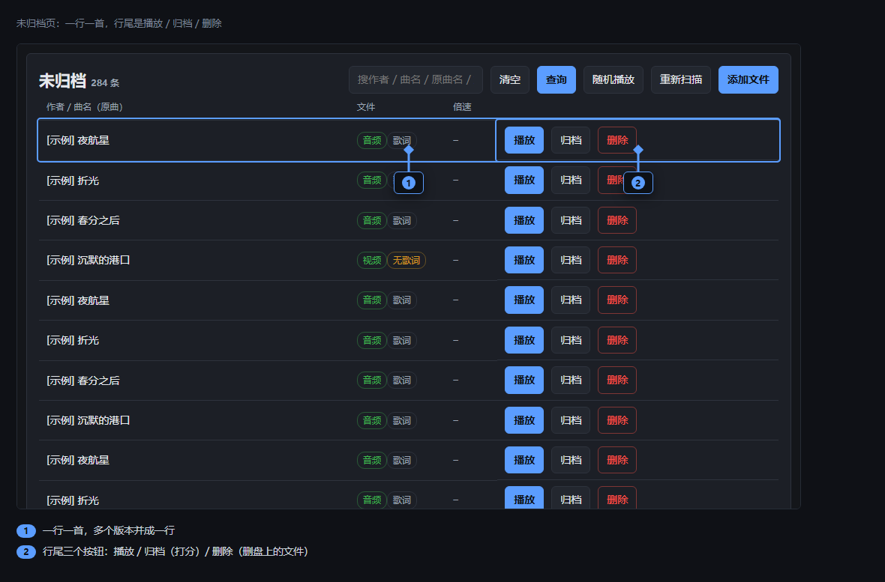

- 一行是一首。同一首歌的多个版本会并成一行，行上写着「×N 版本」。
- 这一页每次打开都按磁盘现在的样子重新列一遍，所以你刚放进文件夹的歌，刷新一下就能看到。

### 工具栏

- 搜索框：搜作者、曲名、原曲名、文件名；**按回车等同点「查询」**。
- **清空**：清掉搜索条件。
- **查询**：按搜索框里的词重新列一遍。
- **随机播放**：把当前这一层的歌洗成一个队列，随机播放，一首一首过。在播放页面里定分归档后，就会自动从队列里移走、接着放下一首，放完为止。**关掉页面，队列就没了**，不会存下来。这一层没歌的时候会告诉你。
- **重新扫描**：按磁盘现在的样子重扫一遍。
- **添加文件**：多选（或者粘路径）一组文件，重排好文件名之后，搬到待打分文件夹、或者直接归档。打开的就是「修改」那个表单。

### 列表区

- **播放**：播放当前音乐，在播放页也可以定分归档。归档后这一行就从列表上消失，记录会移动到“播放”页面。
- **归档**：不播放直接打开表单定档。
- **删除**（红）：**删的是磁盘上的文件，会进 Windows 回收站**，删错了可以从那里还原。它会先给你一张清单，再问你一次。

### 打分就是归档

定档是把这一组文件**整个搬进**对应的分数文件夹里——**不是拷贝，也不压缩**。**这一步不能撤销**，所以定之前想清楚。

打分那一排按钮给的是全部几个分数档，哪怕某个档的文件夹你还没建。**没建的档选下去，程序会自己把文件夹建出来**，名字就是那个分数本身（5 分就是 `#5`）。想给这个档添个说法（比如「好听」），自己去资源管理器里把文件夹名补在分数后面就行——程序认的只是开头那个分数。

目录还没配好的时候，页面上会先出红字提醒你「现在打分会失败」。

> 系统配置里可以打开「归档前强制打标签」。打开之后，没有标签的歌不允许归档，按钮会变灰并写明原因。

## 添加文件

把别处的文件收进来：一次选一组文件，填上作者 / 曲名 / 原曲名，系统照这套信息把文件名重排好，再整组搬进待打分文件夹、或者直接归档。

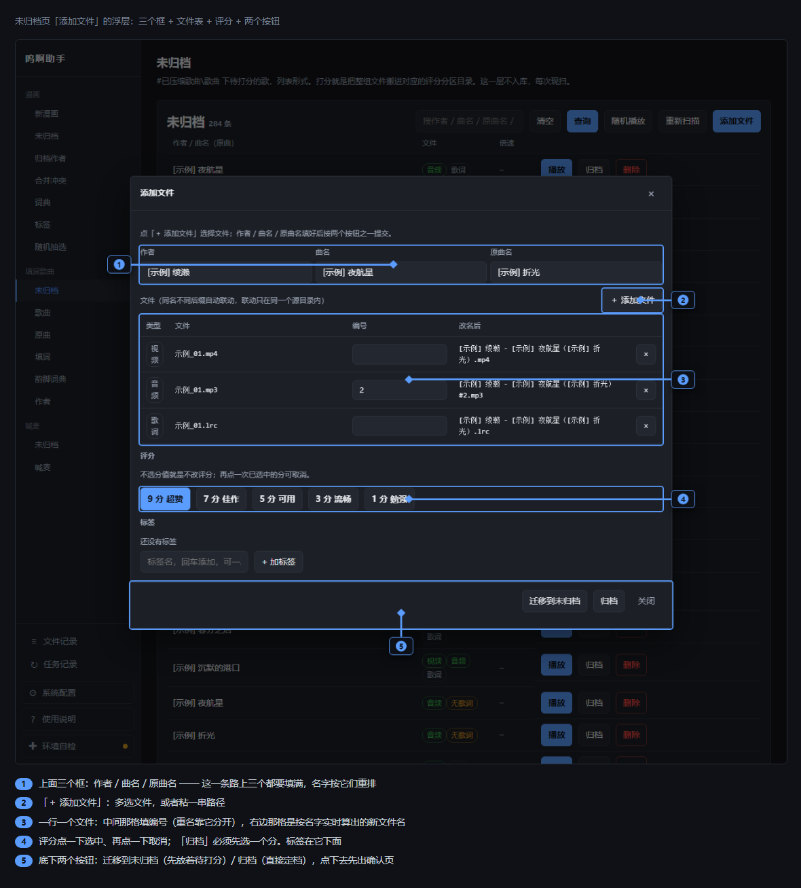

### 挑文件

- 点「**＋ 添加文件**」多选，或者粘一串路径。选的文件可以在任何位置、跨盘也行；只有两个文件夹除外 —— **填词模板目录**和**原曲库**，从那儿选的话那一批会被拒掉并写明原因。
- 跟它们同名的歌词会自己跟着来。
- 每行前面是它的类型（视频 / 音频 / 歌词）。行尾的 **×** 是把这一行移出本次名单，**磁盘上不动它**。
- 例外：这一行要是带着「**已归档**」徽标（那是从已归档的歌里挑来的），**×** 就是「剔除」—— 会先问你一次，提交后它被挪进「冗余」文件夹。

### 三个框就是名字

新名字按「作者 - 曲名（原曲名）#编号」拼，三段缺一段就拼不出来 —— 所以这条路上三个框**必须都填满**。

> 跟别处不一样：已经归档的歌点「修改」时三个框可以留空，那就是不改名、只动评分和标签。**「添加文件」没有「不改名」这条路。**

### 每个文件一个编号框

编号是名字里 `#` 后面那一段，**同一首歌的几个版本就靠它分开**（比如 `#2`）。

- 编号里不许出现 `#`。
- 两个文件重排之后会撞名的话，给其中一个填个编号就能分开；不填，两个按钮都会变灰并写明原因。
- 编号不一定是数字，`ver2`、`少` 这种写法也行。

### 改名后

这一列是按上面三个框加上这一行的编号**当场算出来**的新文件名。三个框还没填满时，这里是一个灰色的「—」。

### 评分与标签

- 「迁移到未归档」用不着选评分；「归档」必须选一个分。
- 这排按钮点一下选中，再点一下取消。
- 系统配置里打开「归档前强制打标签」之后，没打标签不能归档。

### 两个按钮

- **迁移到未归档**：搬到待打分文件夹，之后在列表上再定分。
- **归档**：直接定档，一步到位。

点下去不会立刻动磁盘 —— 先给你一张确认页，写着旧名改成什么、从哪个目录搬到哪里去；你确认了才真搬。有文件动不了的话整批都不执行，并告诉你卡在哪。

## 歌曲

这一页和「未归档」长得像，区别是这里放的是**已经归档**的歌，所以能翻页、能按分数筛。

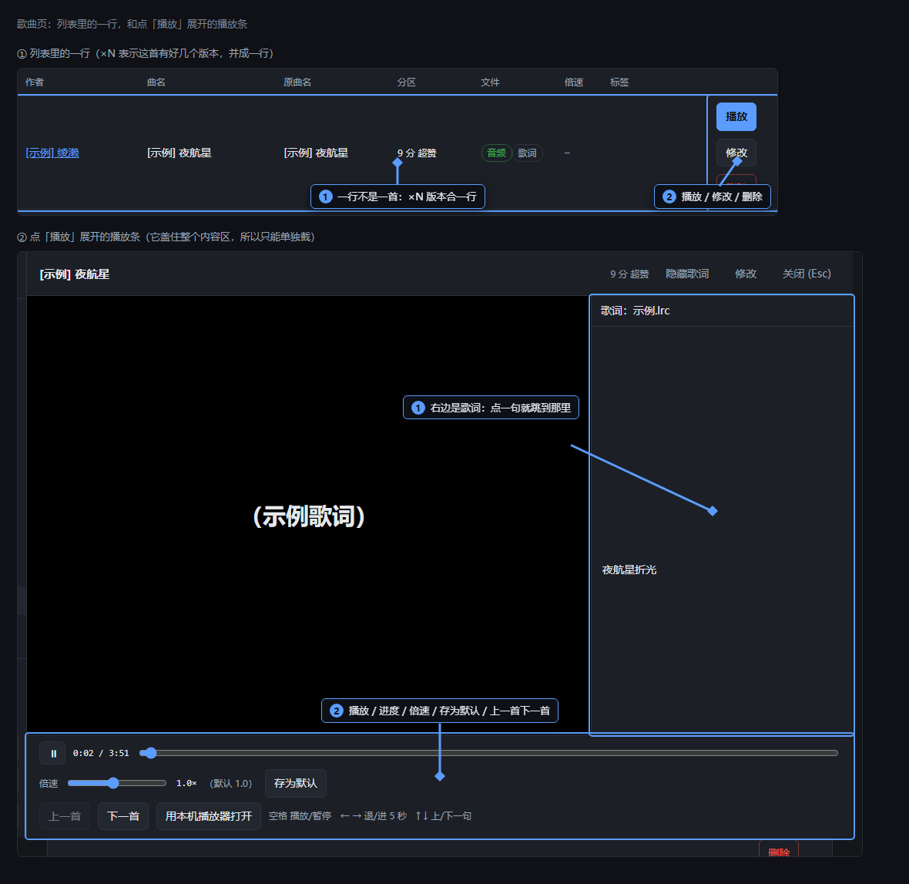

### 工具栏

- **分区**下拉：全部，或者某一档（比如「9 分 超赞」）。**选中就立刻重筛**。
- 搜索框：搜作者、曲名、原曲名、文件名；**回车等同查询**。
- **清空**：把上面几个条件一起复位。
- **只看解析失败**：只留那些从文件名里读不出作者 / 曲名的行。
- **只看需规范化**：只留名字不合规范的行。
- **查询**。
- **批量规范化命名**：把需要改名的行一次改好，点开先给你一张「现名 → 改成」的清单。**一组失败不影响其它组。** 没有需要改的行时这个按钮是灰的。
- **重新同步**：扫一遍磁盘重建记录。你在资源管理器里改过文件名或者挪过分区之后，点它补跑。归档根不在的时候是灰的。
- **随机播放**：先问你从哪几档里抽。列表是空的时候会告诉你。

### 列表区

- 一行不是一首：同一首歌的不同版本合在一行里，上面写着「×N 版本」。
- 「作者」和「原曲名」那两列是**能点的链接**：点作者跳作者页、点原曲名跳原曲页，都已经按它筛好了。
- 「文件」那列的小徽标（视频 / 音频 / 歌词 ×N / 无歌词）只是标签，鼠标移上去能看文件名。
- **播放**：弹出播放条，**能切换版本**（下拉在左上角），切换着听。
- **修改**：打开列表式表单，一次把这一行改完——改作者 / 曲名 / 原曲名、改评分、改标签、增删文件。**改的是这一行的所有版本，不是只有当前显示的那一个。**
- **删除**（红）：**删的是磁盘上的文件，会进 Windows 回收站**。先给清单，再问你一次。

### 冗余文件

页面下方偶尔会多出一张折叠的卡，收着改名或者剔除时留下的旧文件。点**展开**才去读。

它是**只读的**：只告诉你文件还在不在盘上。想删或者搬回来，请去资源管理器里做；想知道是谁什么时候动过的，看左下角的「文件记录」。

## 播放页面

播放条在「未归档」和「歌曲」都能打开，是同一个：

### 上方工具栏

- **标题信息**：左上的作者、曲名、原曲名，其中作者和原曲名可点击跳转到对应页面。
- **版本切换**：右上角的下拉框，只有一个版本时不出现。当一个歌曲有多个版本（比如多个视频）时会出现，可以切换当前播放的版本。
- **隐藏歌词 / 显示歌词**：切换歌词面板。点一行歌词就跳到那一句；你手动滚动歌词时，自动跟随会停 4 秒再跟上。
- **修改**：直接在这里改这一组文件的信息。
- **关闭 (Esc)**。

### 下方控制栏

- **播放 / 暂停、进度条**：同常见的播放器
- **音量**：进度条**右边**那根细条，它左边那个小喇叭和百分比数字就是它 —— 拖动即改动声音大小，拖到最左边（0%）就是静音。**每次打开都回到 100%**，上次调小过不会记住，想小声每次都要拖一下。
- **倍速**（0.5 到 1.6 倍，拖动即生效）、**存为默认**：可调节当前音乐播放速度，
  - 点击「存为默认」后可以「存为组默认」（即当前的这组填词歌曲后续默认按此速度播放）或「存为原曲名默认」（即相同原曲的所有填词歌曲后续默认按此速度播放）
  - 「存为默认」存到哪一层要看情况：已经归档的能选「存为组默认」还是「存为原曲名默认」；待打分的只能存到原曲名上；待打分又解析不出原曲名的，会直接告诉你存不了。
- **上一首 / 下一首**、**用本机播放器打开**。

### 其他

- **键盘操作**：**空格**播放 / 暂停，**← →** 退 / 进 5 秒，**↑ ↓** 上一句 / 下一句歌词，**Esc** 关掉。
- **右侧歌词栏**：如果存入的是 lrc 歌词，则可点击歌词跳到相应唱句。
- 有些视频这台机器解不了（HEVC），**画面会黑、但音频和歌词正常**。这时候顶上会出一条横幅，告诉你点「用本机播放器打开」来看画面。它只是提醒，不拦着你播。

## 原曲

这一页是管原曲素材的地方。同时可以查看同一首原曲，被填了几个版本、都打了几分。

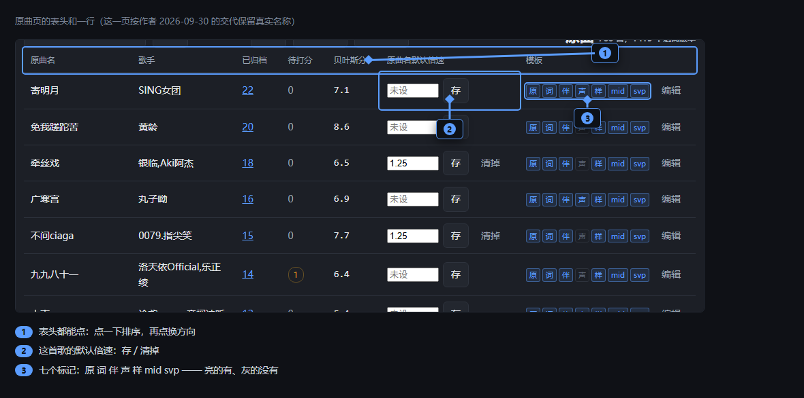

- 模板那一列有七个小标记：原、词、伴、声、样、mid、svp。有文件的是亮色、能点；灰的就是没有。点前面几个是**边听边看歌词**，点「词」是看歌词，点「svp」直接跳到填词页。mid 那个标记点不动。
- 有内容、但还没勾「已确认」的会标成警示色；工具条上的「仅待确认」能把它们一次筛出来。

### 工具栏

- **搜索框**：搜原曲名，边打边筛。
- **搜索**：按关键词重新拉一遍列表。
- **仅待确认**：只留那些「有内容、但还没勾已确认」的。
- **清空**：清掉搜索条件。
- **新增原曲**：从电脑里任意位置选文件，建一条新原曲。
- **重新扫描**：扫一遍模板目录，把信息回写到记录里。

### 列表区

- 可点击表头按照此项正序或倒序排序，各个表头都可以点。
- 贝叶斯分是由「已归档」的数量和各首歌曲的分数分布计算出的分数，高分的权重会更高一些。
- 「已归档」和「待打分」的曲目数分开算，这两个数字都能点，点了会跳到对应的页面。
- 右侧一列「原曲名默认倍速」是这首原曲的默认播放速度。填数后点「存」可保存；不想设就点**清掉**（没有值时这个按钮不出现），清掉之后回落到 1.0 倍。
- 模板那一列有七个小标记：原（原曲）、词（歌词）、伴（伴奏）、声（人声）、样（原词导出demo）、mid（MIDI文件）、svp（SynthV模板）。有文件的是亮色、能点；橙色是有文件但尚未由用户确认，需要打开编辑页面确认；灰的就是没有。
  - 点前面几个是**边听边看歌词**，其中原曲和歌词是一组，伴奏、人声、原词导出demo是一组。
  - 点「svp」直接跳到填词页。

### 新增 / 编辑弹窗

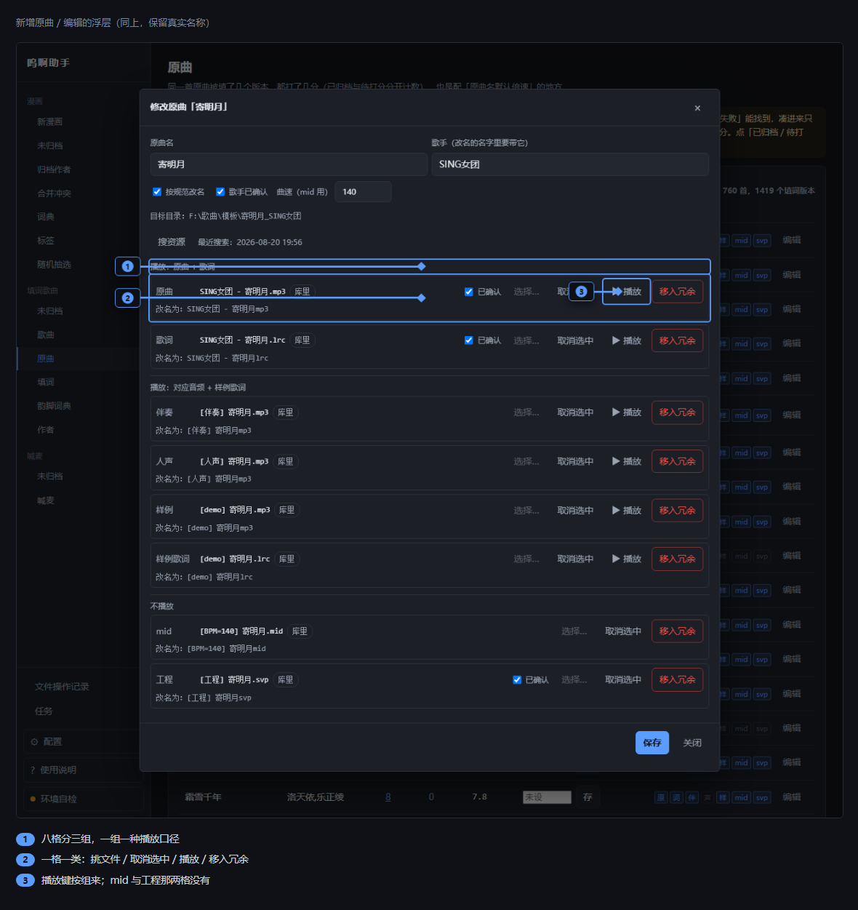

新增一首原曲（工具条上的「新增原曲」）和改一条原曲（行上的「编辑」），用的是同一个弹窗：

- 在这个页面修改、编辑的歌曲**会被移动到用户配置的原曲文件夹中**，子文件夹命名规则为“曲名_歌手”，这一步不能**撤销**。
- 「按规范改名」会把导入的各个文件改成规范化名称，具体格式见提示。
  - **想按规范改名，得先有歌手、并且勾上「歌手已确认」**——名字里要带歌手，没确认过的歌手不敢往文件名里写。勾上「按规范改名」以后，框下面那行小字会实时显示改完的名字。
- 「歌手已确认」勾上之后，扫描模板、搜资源就不会再覆盖这一项。**新增那一条路上，填了歌手就算已确认。**
- **搜资源**：联网搜这位歌手 / 原曲 / 歌词，补全信息。需要注意的是因为数据来源等问题，下载到的往往不太准确，建议还是自己下载手动添加。
- 下面八行文件框，分三组，每一行都能从电脑里任意位置挑文件（可以跨盘），也能从这首原曲已经有的文件里选。
- 「取消选中」主要用于添加新原曲时，避免添加到原曲文件夹；「移入冗余」则是主要在编辑时使用，把已经添加的文件移动到冗余文件夹，后续不会被扫描中。
  - **移入冗余**不是删除：文件被挪到一个专门放旧文件的目录里，想找回来随时都还在。「取消选中」只是这一次不参与改名，文件不动。
- 播放键分三组：原曲和歌词这两行，点哪一行都是「原曲音频 + 歌词」；伴奏、人声、样例、样例歌词这四行，点哪一行都是「这一行的音频 + 样例歌词」；mid 和工程这两行**没有播放键**。
- 原曲名和歌手都不能含 `? / \ : * " < > |` 这几个字符，也不能用点或者空格结尾。不满足的时候，输入框上方会出红字、提交按钮点不动。
- 要是这次改名动到了 svp 里引用的音频，落盘之后会弹一句提醒——**它只提醒、不替你改 svp**。

## 填词

**从哪进来**：左边导航的「填词」，或者原曲页那一列里的 svp 标记。进来先看到的是这首原曲的填词项目列表（一首原曲可以有好几份填词），点一行进编辑器；右上角是「新建填词」。

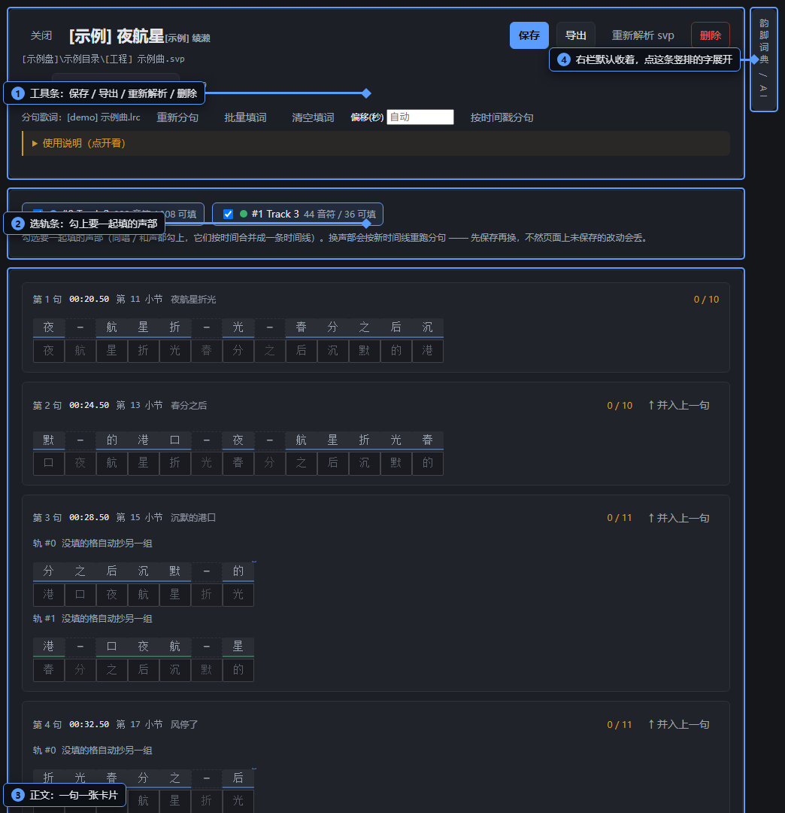

整个页面分四块：

- **顶部工具条**：保存、导出、重新解析、重新分句这些。
- **选轨条**：勾上要一起填的声部。
- **正文**：一句一张卡片。
- **右栏**：默认收着，点右边缘那条竖排的字才会展开。收着的时候不查词典，展开才开始查。

### 填词列表

从左边导航进来时，先看到的是这首原曲的全部填词，一行一份。

- **点一行**进编辑器。
- **新建填词**：再开一份空白的（名字留空的话，程序按序号起名）。
- **刷新**：重新拉一遍列表。
- 每行最右的**删除**：只删这一份填词，**磁盘上的工程文件和歌词一个字都不动**。会先问你一次。
- 从原曲页的 svp 标记进来时，左上角会多一个 **← 返回全部填词**。

### 顶部工具条

- **关闭**：回列表。**有没保存的改动时会先问你**——它不会替你保存。
- **保存**：手动存一份。自动保存不留存档点，**手动保存才留**，所以存过之后才会出现「恢复上次手动保存」。
- **恢复上次手动保存**：把页面上的填写退回你上次手动保存的那一版。它**只改页面、不写库**——想落库还得再点一次「保存」。换过声部之后它就不再出现（那一版对不上号了）。
- **导出**：打开导出浮层。
- **重新解析 svp**：重读磁盘上的工程文件，按音符的新位置把已经填好的词搬过去。**改了工程、或者程序更新了分句算法之后，靠它才生效**。它会盖掉你没保存的改动，所以会先问你。手动断开或者合并过的地方，会跟着失效。
- **重新分句**：只重跑一遍分句。
- **按时间戳分句**：按你给的偏移量强制切分句。
- **删除**（红）：删掉这一份填词，磁盘上的文件不动。
- 名字输入框：改这份填词叫什么。它是这一页最显眼的那一行 —— 一份填词的身份就是它的名字。

#### 保存

每 5 秒自动保存一次，这种自动保存**不留存档点**。点「保存」是**另存一个存档点**，存过之后才会出现「恢复上次手动保存」。状态那里会写着「有未保存的改动」，或者「已自动保存 时:分:秒」。

#### 导出

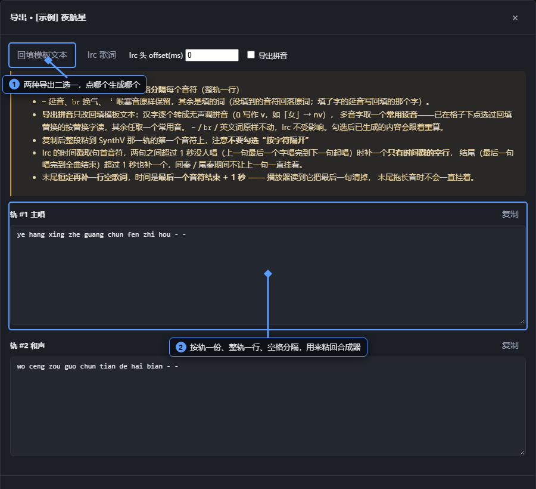

- **回填模板文本**：按轨各一份、整轨一行、用空格分开，用来粘回合成器。每一块旁边只有**复制**。
- **lrc 歌词**：带时间轴的歌词文件。这一块旁边有**复制**，还有一个**下载**。文件**开头**会写上曲名、这份填词的名字和你的署名 —— 署名要先在配置页里填一次，**没填就不写那一行**。
- 「导出拼音」**只对回填模板有效**，切到 lrc 的时候它是灰的。
- 生成 lrc 时用的时间偏移，填在上面那个「lrc 头 offset(ms)」框里。

#### 如何使用回填模板文本

- 选择你要填的音轨的歌词并复制。

- 打开 SynthV 对应模板文件，在音轨区选中你要填写的音轨。

- 在钢琴卷帘区 `Ctrl + A` 选中所有音符，右键打开菜单选择「填入歌词」

- 在打开的对话框中填入复制的歌词。

- **注意**：千万不要勾选「按字符隔开」

  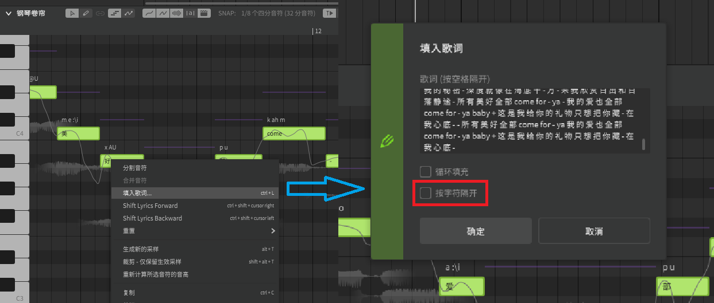

#### 批量填词

点「批量填词」打开一个窗口，把整段歌词一句一行贴进去，点「应用到填写行」。窗口里有两个勾选框：

- **忽略延音（-）**：默认就勾着——延音格不占字。
- **重新分行**：勾上就完全按你贴的文本重排，现有的分句整段作废；换行当句界，行里的空格当视觉空位。

「清空填词」清空这一份的全部格子。它**只清页面上的内容**——没点「保存」之前，刷新页面就能撤回。

### 填词区

#### 一张卡片上有什么

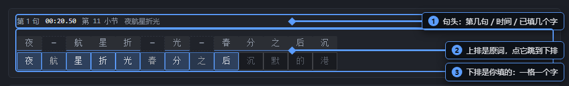

- 卡片顶上写着这是第几句、什么时间、第几小节、已经填了几个字还差几个字。
- **上排是原词行**：灰底、没有框，给你照着看的。点它，光标会跳到下排对应的格子。
  - 原词里那个 `-` 是**延音**，表示上一个字要拖长。
- **下排是填写行**：一格一个字，一格对应一个音符。填的字数和音符对不上时句头会标黄，但**它不会拦着你保存或导出**，只是提醒。
- **延音符  **`-`、**换气符**`br`
  - 延音符和换气符对应填写格在你输入时不会主动填写，只有手动点击这格才能填写。
- 每句句头右边有 「↑ 并入上一句」：把这一句拼回上一句末尾（第一句没有这个按钮）。
- **音轨交叠**：如果一个模板有多个音轨在同一时间音符和歌词大致相同，它们会合并成同一句，表现为同一句中的多行。

#### 断句

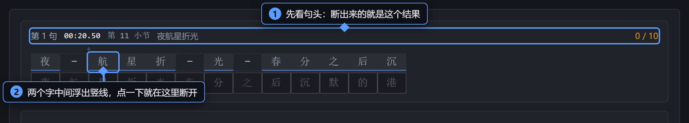

- 把鼠标放到原词行两个字中间，会出现一条竖线，**点一下就在这里断开**。断点如果落在延音格上，程序会自动往后挪一格——延音只留在句尾，不留在句首。

- 想把手动改的全撤掉，点「重新分句」重跑一遍。

- 程序自带的分句是由svp模板和demo歌词共同解析而来。分句顺序是先照参照歌词逐字对齐，对不上就按时间戳，两样都没有就按换行和大空隙粗分。分出来的结果跟模板对不上时会出一条黄色提醒——一种是「对不上」，多半是原曲页的「样例歌词」配错了，去那里核对；另一种是「只对上了一部分」，个别句界可能不准。**两种都只提示、不改分句**。

- 歌词和音符整体错位的时候，先在「偏移(秒)」里填一个偏移量，再点「按时间戳分句」；偏移框空着就点它，会先提醒你把它填上。

#### 加空格

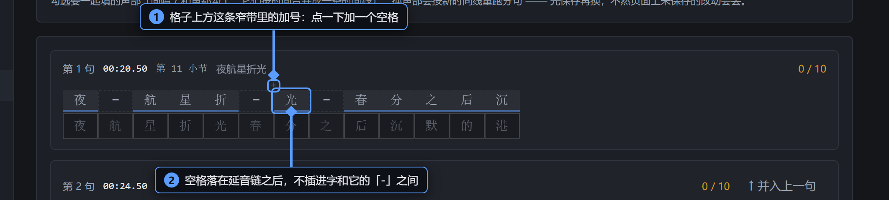

- 空格用于分句，只影响导出lrc歌词。

- 鼠标移到格子上方那条窄带上，两个字之间会出现一个淡淡的加号，点一下就在这里加一个空格；已经有空格的地方常驻一个记号，点它取消（点那个空格列本身也是一样的效果）。

- 空格只能加在字与字之间，第一个字之前、最后一个字之后都没有位置。而且空格一定落在**延音链之后**——某个字后面跟着一串延音时，空位记在那串的末尾，而不是紧跟在这个字后面。这是故意这么做的，否则导出的歌词会把字和它的延音断成两段。

- 这里没有拖拽，只有点击。点一下会同步到同一个音符的其它声部（合唱、和声两边一起变）。

#### 多音字

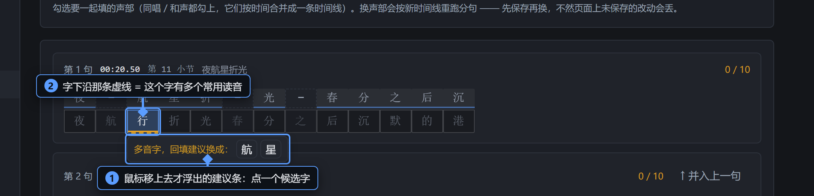

- 填进去的字如果有多个常用读音，这一格下沿会出现一条橙色的虚线；只有冷门读音的字，用的是更暗的虚线。

- 鼠标移上去，下面会浮出一条建议，后面跟着一串候选字，每个候选字只用一个读音。点一个候选字，它会以绿底小字常显在格子下方；再点一下取消。

- 多音字建议**只影响导出回填模板时用哪个字，不影响lrc歌词导出**。另外，「好」「中」这种只有声调不同的字不算多音字——音符本身没有声调，程序判不了，也不会提醒它。

#### 输入填写行

- 输完一个字会自动前进到下一格，并且**自动跳过延音**。
- 一次敲进去好几个字（输入法整词上屏、粘贴）时，第一个留在本格，其余往后依次摊开；放不下的会丢掉，状态那里闪一下提示。
- 按住鼠标拖动可以**选中一段字**（同一句同一行之内）。选中之后：打字整段替换，Ctrl+C 复制，退格整段清空，Esc 取消选中。
- **退格能跨句**：在空格上退格会回到上一格继续删，行首退格会跳到上一句的行尾。回车跳下一句，Shift+回车回上一句。
- 出现音轨交叠的情况时，填写完一个字会自动复制到同句其他音轨没有填写的格子里。

#### 合唱与和声

- 即前文所提到的音轨交叠。
- 同一句里如果有多个声部，会分成几组显示，行头写着「轨 #1+#2」这种。**只填一组就行**——另一组会在你离开那一格时自动抄过去（只补空格子，不覆盖你已经写的），如果没填写可以用左右键移动一下光标即可，导出只算一份。像「A（B）」这种双声部会合成一句显示，导出的时候括号会写回去。

- 改「选轨条」里勾了哪几条声部，会按新的时间线重跑分句，所以会先问你一次；至少得留一个声部。

### 右栏：韵脚词典

点页面右边缘那条竖排的字，右栏展开（再点收起）。里面两个页签：

- **韵脚词典**：跟你点过的那个填词格联动——点哪个格就查那个字；点一个候选词，直接填进你最后点过的那个格。也可以自己把字打进「锚」框，清空就回到跟随。
- **AI填词**：当前基本无法正常使用，所以隐藏掉了。

## 韵脚词典

这一页用来查押韵：一个字、一个韵母，能配哪些字和词。

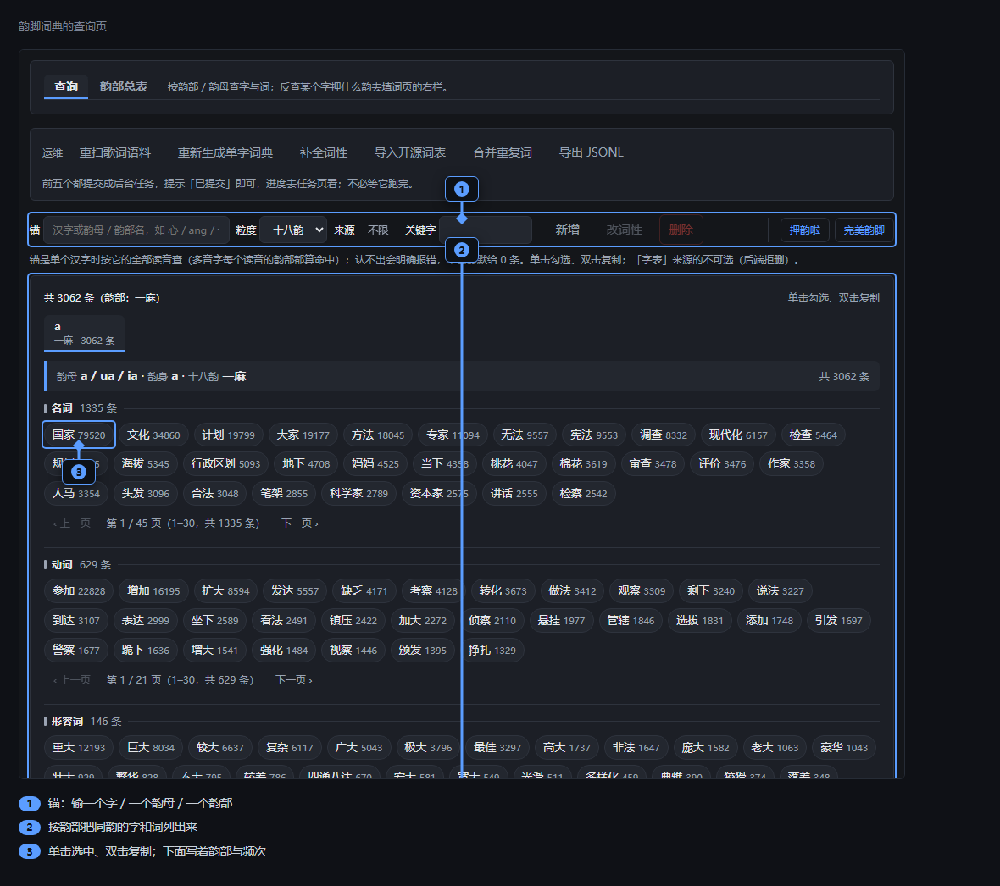

上面两个页签：**查询**和**韵部总表**。

### 查询页签

- **锚**框：输入一个汉字、一个韵母，或者一个韵部的名字，右边按韵部把同韵的字和词列出来。边打边查，**按回车也一样**。
- **粒度**下拉：按十八韵分，还是按韵母分。
- **来源**：字表 / 词表 / 手动 / 语料 / 开源，点开面板勾选；面板里有个**清空**，一下全取消。
- **关键字**：在这一批结果里再按词面筛，边打边查。
- **新增**：一次粘一大批词（一行一个，词后面可以跟拼音，比如「碎星 suìxīng」）。提交后告诉你解析了几行、新增几条、跳过几条；**有失败的行会列出来让你改**，全成功了才关窗。
- **改词性**、**删除**（红）：得先在下面点方块把词选上，按钮上会跟着显示选了几条；一条都没选的时候这两个按钮是灰的。删除会先问你一次。
- 底下那些方块：**单击选中、双击复制**。同一份东西在填词页右栏里也能用，那边单击就是把词填进你最后点过的那个填词格。
- 每个方块下面写着这个词落在哪个韵部、出现得多不多。翻页是每个块各翻各的。

认不出你输的东西时会直接说原因——「一条都没有」和「认不出这个锚」是两回事，显示得不一样。

### 韵部总表页签

列出每个韵部、每个韵母各有多少条。**点一行就跳到查询页签，并按它查一次。**

### 工具条上那几件维护

重扫语料、重新生成单字词典、补全词性、导入词表、合并重复词——**都在「任务记录」里跑**，进度去那里看，不用在这儿等着。每一个都会先问你一次要不要提交。

其中**补全词性**要用本机的 AI，没配的话这个按钮根本不出现，只显示一句说明。

**导出 JSONL** 不一样：它当场把语料导出成一个文件下载下来，不是后台任务。

### 两件小事

- 工具条上的「押韵啦」「完美韵脚」只是**跳到外面的网站**，不会替你去抓那个站。
- 这一页里**没有**任何会碰磁盘的动作，改的都是词典本身。

## 作者

统计填词作者的信息

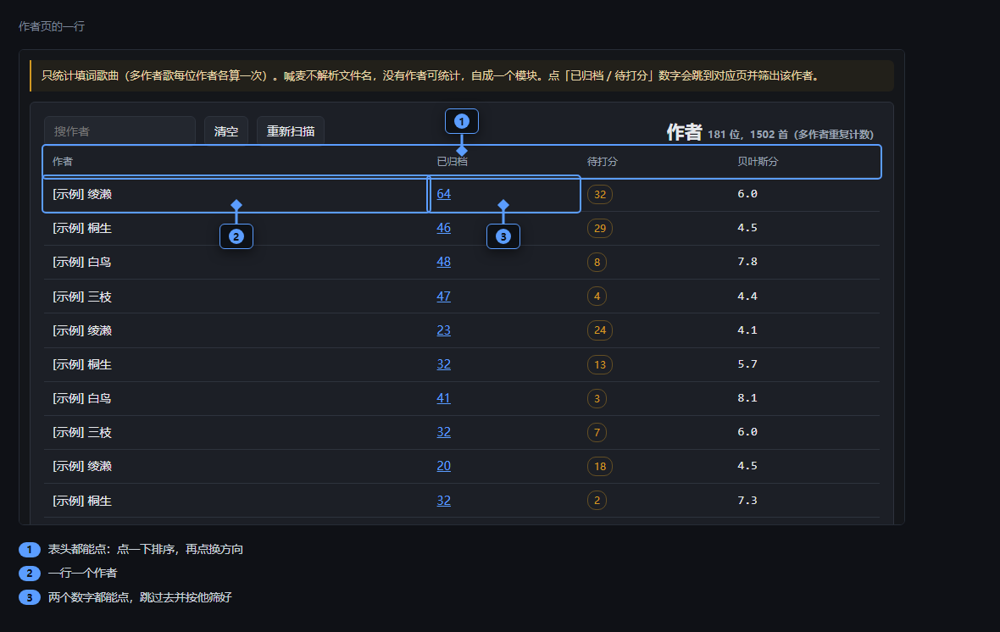

- 一行一个作者。
- 后面的「已归档」「待打分」两个数字都能点，点了跳到对应的页面，并且已经按这位作者筛好了。待打分是 0 的时候是灰的。
- 表头都能点，点一下按那一列排，再点一下换个方向。
- 工具条上就三件：搜索框（搜作者，边打边筛）、**清空**、**重新扫描**。
- 统计规则和原曲页一样：同一首歌的多个版本算一条。
- 「A & B - 歌名」这种多作者的歌，每位作者各算一次，所以这一页的总数会比实际歌数多——那是故意的，为的是看清每个人的产出。
